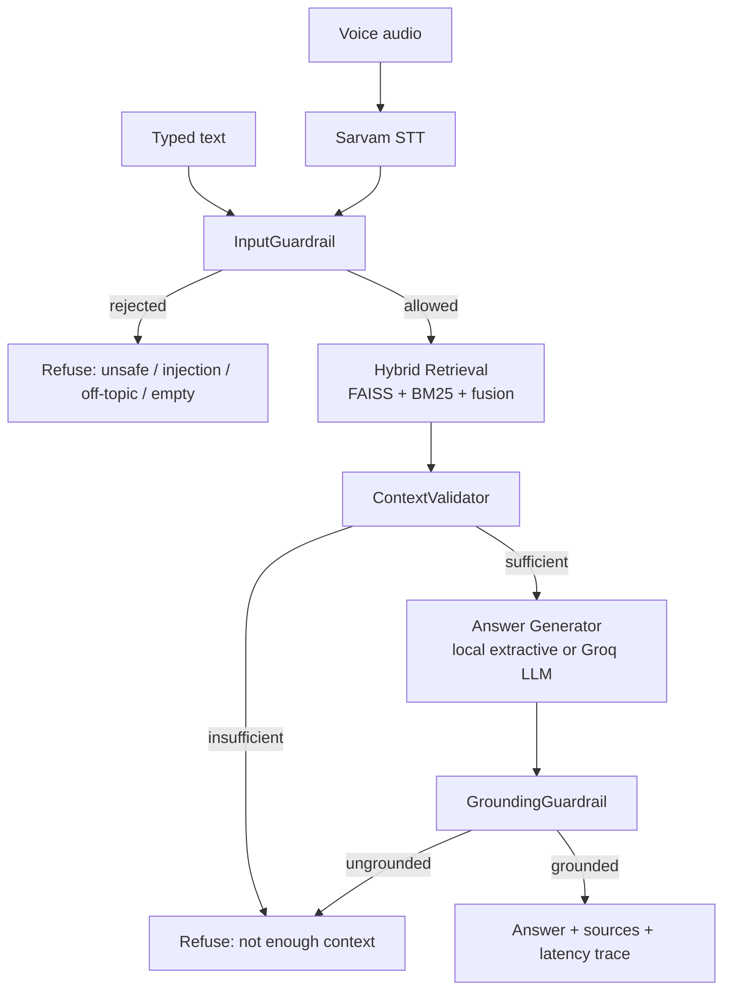

# Architecture

## What this is

A voice-and-text RAG system over a real slice of `ai4bharat/MSMARCO-XI`
(16,156 indexed chunks from 62 source records, expandable to the full
dataset by rerunning the ingest scripts). A user asks a question — by voice
in an Indic language, or by typing in English, Hindi, an Assamese/Bengali
script, Marathi, Gujarati, Telugu, or Kannada — and gets back an answer that
is either grounded in a retrieved passage, or an honest refusal.

## Component map

```
frontend/            Static HTML/CSS/JS UI. Talks to the API over fetch();
                      no server-side rendering, no build step.
src/api.py            FastAPI app. Three real endpoints: /health, /api/text,
                      /api/voice. Owns request tracing (X-Request-ID) and
                      the lazy-singleton pipeline instances.
src/rag_pipeline.py    RAGPipeline: the orchestrator. Owns the sequence
                      input-gate -> retrieve -> context-gate -> generate ->
                      grounding-gate, and the per-stage latency trace.
src/voice_rag_pipeline.py
                      Thin wrapper: STT -> RAGPipeline.answer(). Keeps voice
                      and text sharing the exact same guarded pipeline
                      rather than duplicating guardrail logic for voice.
src/speech_to_text.py  Sarvam STT client (saaras:v3). Provider-abstracted
                      (BaseSpeechToText) so a different STT vendor is a
                      class swap, not a rewrite.
src/chunking.py        Three chunking strategies (sentence, overlapping-
                      window, adaptive-by-length) behind one registry.
                      overlapping_window (window=3, overlap=1) is what's
                      actually served; the others exist and are tested
                      (test_chunking.py) but not wired into the default
                      ingest path today.
src/embeddings.py      MultilingualEmbedder, backed by fastembed (ONNX
                      Runtime) rather than sentence-transformers/PyTorch --
                      see "Why fastembed" below.
src/vector_store.py     FAISS flat index wrapper (dense/semantic search).
src/bm25_store.py       rank_bm25 wrapper (sparse/keyword search).
src/hybrid_retriever.py Fuses the two: FAISS min-max normalized, BM25
                      saturating-normalized (score/(score+k)), combined
                      70/30. See "Why two different normalizations" below.
src/guardrails.py       InputGuardrail (regex: injection, unsafe, off-
                      topic, empty/no-content), ContextValidator (score
                      thresholds + named-entity presence), GroundingGuardrail
                      (content-word overlap between answer and evidence).
src/generator.py       Provider-abstracted answer generation: a local
                      extractive generator (no network call, ~0.3ms) or
                      Groq's hosted LLM, selected by GENERATOR_PROVIDER.
```

## Data flow at a glance



Every request produces a `latency` object broken into
`input_guardrail_ms / retrieval_ms / generation_ms / grounding_ms /
total_ms`, and every response carries a `status` (`answered` /
`rejected` / `insufficient_context` / `failed`) plus a human-readable
`guardrail_reason` explaining *why*, not just *that*, a request was
declined. See `FLOW.md` for the full request lifecycle and the reasoning
behind each guardrail decision.

## Why hybrid retrieval, not just dense

Dense (FAISS) retrieval catches semantic/cross-lingual matches; sparse
(BM25) retrieval catches exact keyword/proper-noun matches dense embeddings
sometimes miss. Neither alone was reliable enough on this dataset's short
passages during development — see the BM25 normalization note below for a
concrete failure mode that motivated the current fusion design.

### Why two different score normalizations

Both signals get combined via a weighted sum, but the normalization method
differs on purpose:

- **FAISS (dense)**: cosine similarity is already bounded to roughly
  [-1, 1] and comparable across queries, so per-query min-max rescaling
  is safe.
- **BM25 (sparse)**: raw scores are unbounded and, on a small corpus,
  wildly unstable — a single incidental token match can produce the
  *highest* raw score among a query's candidates purely because IDF blows
  up on small sample sizes, and min-max would then rescale that spike to
  1.0 regardless of whether it's actually relevant. This was caught
  directly during development: a query about corporations was ranking an
  unrelated passage first because of exactly this effect. BM25 is instead
  passed through a saturating transform, `score / (score + k)`, which
  scores each candidate by its own magnitude rather than its rank among
  whatever else got retrieved this turn.

## Why three separate guardrail stages, not one

- **Input gate** (regex, near-zero cost): catches unsafe requests, prompt
  injection (including task-redirect phrasing like *"forget the above,
  do X instead"*, which is a distinct bypass from *"ignore your
  instructions"*), off-topic requests, and empty/no-content queries
  *before* spending a retrieval or generation call on them.
- **Context gate** (retrieval-score threshold + named-entity presence):
  decides whether *anything relevant* was actually found. Entity presence
  checks only ASCII proper nouns capitalized in the original query text
  (not every uncommon word) against retrieved passage text, and is skipped
  entirely when the retrieved passage is in a non-Latin script, since an
  ASCII substring can never appear in one by definition.
- **Grounding gate** (content-word overlap between answer and cited
  evidence, stopwords excluded): catches the case where retrieval found
  something relevant but the generator's answer isn't actually supported
  by it — the classic RAG hallucination failure mode, which a
  score-threshold on retrieval alone cannot catch because the retrieval
  can be fine and the *generation* can still drift.

Each stage fails closed: if the pipeline can't tell whether an answer is
safe/relevant/grounded, the answer shown to the user is a refusal, never
a best-effort guess.

## Why fastembed (ONNX) instead of sentence-transformers (PyTorch)

The original implementation used `sentence-transformers` directly. Under a
512MB container memory limit (Render's free tier), it reliably got
OOM-killed — reproduced locally with `docker run --memory=512m` before
and after the swap. The cause wasn't the specific embedding model; PyTorch's
own baseline import/runtime overhead was enough by itself to blow the
budget. `fastembed` runs the identical model weights through ONNX Runtime
instead, with no PyTorch dependency, cutting the Docker image from 3.16GB
to 1.38GB and runtime memory from >512MB (OOM) to ~473MB (stable). The
model is also pre-fetched at Docker build time rather than downloaded on
the first request — the first cold request paid an unauthenticated,
rate-limited ~30-35s Hugging Face fetch before this was fixed.

## Provider abstraction

Both the STT layer (`BaseSpeechToText`) and the generation layer
(`BaseAnswerGenerator`) are behind small abstract interfaces specifically
so the demo can run entirely offline/free (`GENERATOR_PROVIDER=local`,
extractive, no API key needed) or with a real hosted LLM
(`GENERATOR_PROVIDER=groq`) without touching the rest of the pipeline —
the guardrails, retrieval, and API layer don't know or care which one is
active.
