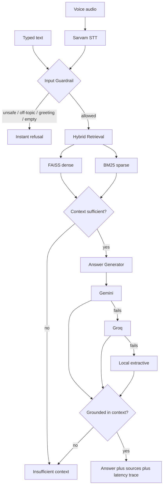

# Architecture

A voice-and-text RAG system over `ai4bharat/MSMARCO-XI` (16,156 indexed
chunks). Ask a question — by voice in an Indic language, or typed in
English, Hindi, Bengali, Assamese, Marathi, Gujarati, Telugu, or Kannada —
and get back an answer that's either grounded in a retrieved passage, or an
honest refusal. Same shape as the task brief:

**Voice input → Speech-to-text → Chunking/Retrieval (vector DB) → Answer
generation** — with guardrails wrapped around every stage.

## Flowchart

## Components

| Layer | File | What it does |
|---|---|---|
| Speech-to-text | `src/speech_to_text.py` | Sarvam STT (`saaras:v3`), provider-abstracted |
| Chunking | `src/chunking.py` | 3 strategies: sentence, overlapping-window, adaptive-by-length |
| Vector DB | `src/vector_store.py`, `src/bm25_store.py` | FAISS (dense) + BM25 (sparse) |
| Retrieval fusion | `src/hybrid_retriever.py` | 70% FAISS + 30% BM25, different normalization per signal (see below) |
| Guardrails | `src/guardrails.py` | Input (unsafe/off-topic/chit-chat), Context, Grounding |
| Generation | `src/generator.py` | Gemini → Groq → local extractive, each with retries |
| Orchestration | `src/rag_pipeline.py` | Runs the stages above, builds the latency trace, owns the response cache |
| API | `src/api.py` | FastAPI: `/health`, `/api/text`, `/api/voice` |
| UI | `frontend/` | Static HTML/CSS/JS, talks to the API over `fetch()` |

## Three design decisions worth knowing

1. **Two normalizations for one fusion score.** FAISS cosine similarity is
   already bounded and comparable across queries (safe to min-max
   rescale). BM25 is unbounded and unstable on a small corpus — one
   incidental token match can spike to the top raw score and get rescaled
   to 1.0 by min-max even when irrelevant. BM25 instead uses a saturating
   transform, `score / (score + k)`, scored by its own magnitude, not its
   rank among this query's candidates.

2. **Three guardrail stages, not one.** Input (regex, near-zero cost)
   catches unsafe/off-topic/chit-chat *before* paying for retrieval or
   generation. Context (score threshold + entity check) catches "nothing
   relevant was found." Grounding (word-overlap between answer and cited
   text) catches the case retrieval was fine but the LLM's answer drifted
   from it — the classic hallucination failure a retrieval-only check
   can't see. Every stage fails closed: uncertain means refuse, never a
   best-effort guess.

3. **A 3-provider generation fallback, not a single API call.** Gemini is
   tried first; on failure (rate limit, timeout, bad response) it falls to
   Groq; if that also fails, to a local extractive answer — so the system
   never visibly errors out, it just quietly downgrades. Every response
   reports which provider *actually* answered, not just which one was
   configured, so the "external LLM" latency shown in the UI is always
   honest.

See `FLOW.md` for a single request traced step by step.
