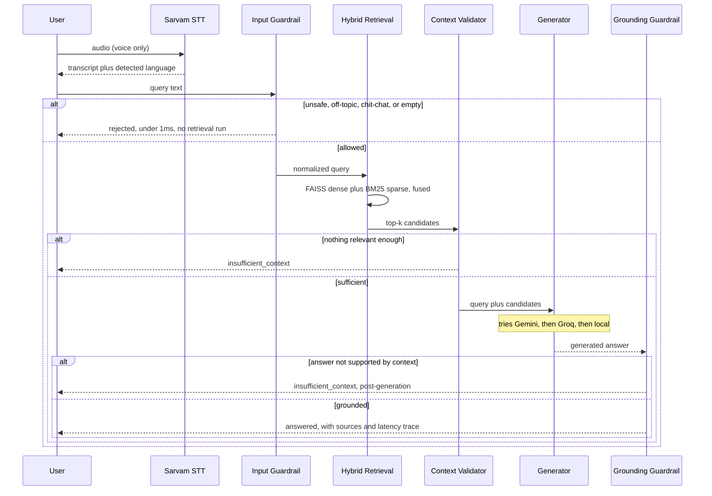

# Request Flow

One request, traced step by step. For *why* it's shaped this way, see
`ARCHITECTURE.md`.

## What each stage can decide

| Stage | Rejects when | Cost if rejected |
|---|---|---|
| **Input Guardrail** | unsafe request, prompt injection, off-topic, chit-chat/greeting, or empty | <1ms — no retrieval or generation ever runs |
| **Context Validator** | top retrieved passage scores below threshold, or the query names an entity absent from the context | ~30-90ms — retrieval ran, generation didn't |
| **Grounding Guardrail** | the generated answer isn't actually supported by the cited passage (word-overlap check) | full generation cost already paid — this is the hallucination catch, not a cheap one |

## The four outcomes

| `status` | Meaning | Real example |
|---|---|---|
| `rejected` | Input gate declined before any retrieval | `"how to make a bomb at home"` → unsafe |
| `insufficient_context` | Nothing relevant enough retrieved | `"speed of light in a vacuum"` against a corporation-focused corpus |
| `insufficient_context` (post-generation) | Retrieval was fine, generated answer wasn't grounded in it | Caught by the grounding gate — a distinct failure mode from the one above |
| `answered` | Passed all three gates | `"what is a corporation?"` → grounded, cites the passage |

## Voice adds one step, doesn't skip any

`POST /api/voice` runs Sarvam STT first, then hands the transcript to the
*exact same* `RAGPipeline.answer()` used by `/api/text` — voice and text
share one guarded pipeline, not two. The response adds `transcript`,
`language`, and `stt_ms` on top of the usual fields.

## Latency budget

The 200ms target covers the in-process pipeline — input gate through
grounding gate — and excludes STT and LLM generation, both real network
calls to external providers. The UI shows both numbers side by side rather
than folding them into one total that would need explaining away.

Measured via `src/benchmark_e2e_latency.py`, 20 distinct queries (answerable,
multilingual, insufficient-context, and rejected — not just best-case),
local extractive generator:

| Percentile | Latency | Within budget |
|---|---|---|
| P50 | 25.3ms | yes |
| P70 | 29.6ms | yes |
| P100 (max) | 63.0ms | yes (40/40, 100%) |

## Why generation is 3 providers deep

`src/generator.py` tries Gemini first, falls to Groq on failure, falls to a
local extractive answer if both fail — so a rate-limited or down provider
degrades the *answer style*, never the ability to respond at all. Every
response's `metadata.generator_provider` reports whichever one actually
answered that specific request, not just the one configured as priority —
so the "external LLM call" time shown in the UI is always attributable to
a real provider, never a guess.
